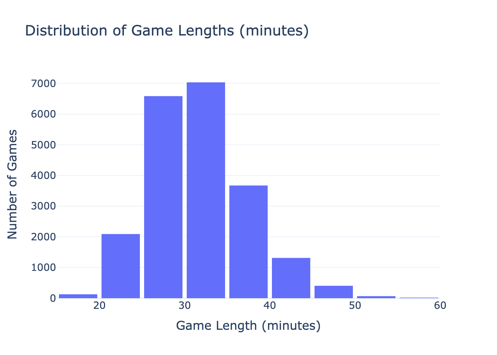
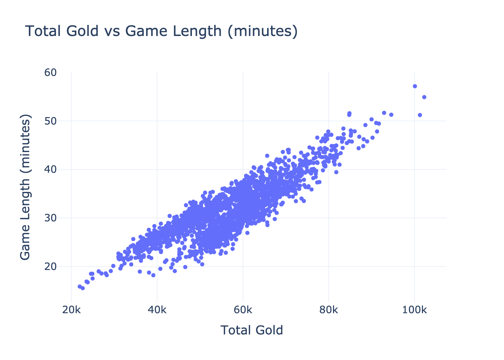

# EECS 398 Project

## Introduction

Our dataset features 12,549 League of Legends games from tier one professional leagues in 2022. It provides a variety of statistics at both the team and individual level for each of these games. The dataset has 150,588 entries with 161 features which includes some match metadata.  

## How does the way a team plays affect how long a game lasts?

As players ourselves, we’re curious whether certain strategies or playstyle (i.e aggressive early fighting, vision control, or objective focus) correlate with shorter or longer games. Do dominant teams close out quickly, or do games tend to go long regardless of early performance? 

Using our intuition and experience as players, we selected the following columns to aid us in our analysis:

| Name of Column     | Description                                                                 |
|--------------------|-----------------------------------------------------------------------------|
| `golddiffatXX`     | The difference of gold between opposing teams or players at XX minutes (10, 15, and 20) |
| `xpdiffatXX`       | The difference of experience between opposing teams or players at XX minutes (10, 15, and 20) |
| `towers`           | The number of towers destroyed by a team                                    |
| `inhibitors`       | The number of inhibitors destroyed by a team                                |
| `gamelength`       | The length of a game measured in seconds                                    |
| `side`             | Which side a person/team belongs to                                         |
| `gameid`           | Unique identifier for each game in the dataset                              |
| `totalgold`        | The amount of gold collected for a team/player                              |
| `champion`         | The champion that a player played                                           |
| `position`         | The role that a player took on                                              |
| `datacompleteness` | Whether or not data collection for a game is complete                       |

---

## Data Cleaning and Exploratory Data Analysis

### 1. Filtering for Complete Data

Since some game data is incomplete (remakes or other data collection errors), it is imperative that we exclude this data from our analysis. In order to exclude such data, we filtered the dataframe on the `datacompleteness` column. As a result, we can ensure that only fully recorded games are included in our analysis and ensure the integrity of our dataset.

### 2. Dropping Unnecessary Metadata Columns

From observation, some data was clearly irrelevant to our analysis. We opted to drop metadata columns such as `participantid`, `playerid`, and `url` as they do not contribute to understanding game outcomes or player/team performance. Dropping these columns reduces the dimensionality of our dataset and allows us to direct our attention to more meaningful features.

### 3. Separating Team and Player Statistics

This data included both team and player stats which is identified by the `position` column. Separating them makes interacting with the data easier since we can use the correct data frame depending on the context. This separation enables a more focused analysis on team or individual stats and their respective impact.

### 4. Dropping Columns with All NaN Values

Some columns are completely NaN since they are either a purely individual stat or team stat. Therefore, we drop the columns that are all NaN for each respective dataframe. Removing these columns cleans up the dataset and ensures that only relevant features are retained. This step reduces clutter and improves the interpretability of the data.

### 5. Creating Derived Features

The raw dataset contains separate columns for a team's towers/inhibitors and their opponent's towers/inhibitors. By calculating the difference between them, we can get a clear image on who has the advantage in the game. Alongside this, we will create another column for game length in minutes (instead of seconds). These features simplify the analysis by directly quantifying the team's advantage in these objectives and make game length more clear. This makes it easier to analyze their impact in the matches.

---

## Univariate Analysis

The plot above displays the distribution of the game lengths. This distribution is slightly right-skewed with most games taking between 25–35 minutes. In respect to our original question, this tells us that game lengths follow trends; it is not completely random and dependent on the teams playing.

---

## Bivariate Analysis

The plot above displays the relationship between total gold and game length. There is a clear positive correlation, indicating that as total gold increases, so does the duration of the game. In the context of our question, this suggests that total gold is a strong indicator of game length and could serve as a valuable feature.

---

## Interesting Aggregates

The pivot table above summarized the average game length (in minutes) based on champion and position in our dataset. Each row corresponds to a unique champion, and each column under position shows the mean game length for that champion when played in that specific role. NaN values indicate that the champion was not played in that role.

| Champion | Bot   | Jng   | Mid   | Sup   | Top   |
|----------|-------|-------|-------|-------|-------|
| Aatrox   | 25.02 | NaN   | 30.30 | NaN   | 31.18 |
| Ahri     | 26.73 | 23.95 | 31.99 | NaN   | 28.10 |
| Akali    | 26.17 | NaN   | 31.27 | NaN   | 32.90 |
| Akshan   | NaN   | NaN   | 31.04 | NaN   | 32.02 |
| Alistar  | NaN   | NaN   | NaN   | 31.78 | NaN   |
| Zeri     | 32.03 | 34.16 | 31.76 | NaN   | 32.11 |
| Ziggs    | 31.28 | NaN   | 31.32 | 32.67 | 31.75 |
| Zilean   | 28.52 | NaN   | 30.94 | 32.27 | 31.41 |
| Zoe      | NaN   | NaN   | 32.02 | 33.70 | NaN   |
| Zyra     | NaN   | NaN   | NaN   | 32.64 | NaN   |

---

## Imputation

Taking into account the context of our dataset and our target question, we have opted not to impute any data. Matches in League of Legends can swing on a dime — what this means is that when we impute data we are almost always going to inject assumptions that may not hold.

---

## Framing the Decision Problem

### Can we accurately predict the length of a League of Legends game using postgame data?

Our problem is a regression task that aims to predict the `gamelength` column of the dataset. We chose this approach to explore whether postgame statistics contain enough information to estimate how long a match lasted.

We use **Mean Squared Error (MSE)** as our evaluation metric because it provides a clear and interpretable measure of how far our model’s predictions are from the actual game lengths. Unlike other metrics like R², which only tells us how much variance is explained by the model, MSE quantifies the prediction errors in a real-world applicable way. This makes it especially useful when we care not just about relative model performance, but also about how far off in seconds the predicted game lengths actually are.

---

## Baseline Model

The baseline model utilizes 17 variables which are:

- `totalgold`, `earnedgold`, `goldspent`, `earned gpm`
- `deaths`, `teamkills`, `damagetochampions`, `dpm`
- `minionkills`, `monsterkills`, `cspm`
- `visionscore`, `vspm`, `wardsplaced`, `wpm`
- `team kpm`, `ckpm`

These features are all quantitative, so no special encoding or transformations were required. There are no ordinal or nominal features in this version of the model.

Our baseline model achieved a **MSE of 295.97** while utilizing the **Random Forest Regressor**. This indicates that the model is performing reasonably well, with predictions typically being off from the true game length by a decent amount. While the error is not negligible, it suggests that the model is capturing meaningful patterns in the postgame data. The fact that it is able to do this suggests that we can improve performance if we use more robust techniques.

---

## Final Model

For the final model, we opted to change how six highly skewed features were represented. The features `team kpm`, `ckpm`, `deaths`, `earned gpm`, `damagetochampions`, and `teamkills` all have heavy right-tail or left-tail behavior because games that are not close (i.e., one team is dominating) generate extremely different data than slower, more balanced games.

We changed these features by passing them through a **QuantileTransformer** that maps their quantiles onto a normal distribution (monotonically). This makes the linear model’s assumptions more valid.

Then, we applied a **StandardScaler** to the entire feature matrix in order to give all the features a common numerical scale. This is important because we used a **Lasso model**. The Lasso model is linear regression with an L1 penalty applied; therefore, if we did not normalize all of these values, large-magnitude columns would be subject to less penalization.

As mentioned earlier, our final model used Lasso, which is a linear regression model that utilizes L1 regularization. We chose Lasso because it is able to perform feature selection by shrinking the less relevant feature’s coefficients to 0. This is particularly useful in our scenario because of the number of overlapping/correlated features in the dataset.

### The hyperparameters that ended up performing the best were:

- Alpha: `0.0026`  
- Fit intercept: `True`  
- Maximum iterations: `10,000`  
- Positive coefficients: `False`  
- Selection method: `Cyclic`  
- Tolerance: `1e-05`  

In order to find these best-performing hyperparameters, we searched for them using **GridSearchCV**. We used five-fold cross-validation with negative MSE as our scoring metric.

Overall, our final model outperformed our baseline model by reducing the mean squared error from **295.97 seconds to 0.0557 seconds**. This performance increase is a reflection of the benefits of quantile-based transformation on our skewed features and the L1 regularization’s ability to reduce the amount of redundant features. In addition to the increased predictive performance, our final model also offered greater interpretability by highlighting two prominent features: `deaths` and `earned gpm`.

---

## Authors

**Jawad Najar**  
**Ali Boussi**